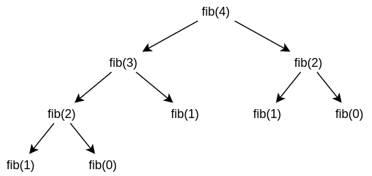

# II. Рекурсивные определения правил
Факты:
```prolog
parent(tom,bob).
parent(ann,bob).
parent(tom,liza).
parent(bob,mary).
parent(bob,luk).
parent(luk,kate).
```
Напишем программу "Предшественник":
```prolog
predecessor(X,Y):-parent(X,Y).
predecessor(X,Y):-parent(X,Z),predecessor(Z,Y).
```
Если `X` - родитель `Y` или `X` - родитель `Z`, который является предшественником `Y`, то `X` - предшественник `Y`.
```prolog
?-predecessor(tom,mary).
yes
```
Рассмотрим, как PROLOG будет доказывать это утверждение. Пронумеруем все правила и факты:
```prolog
1) parent(tom,bob).
2) parent(ann,bob).
3) parent(tom,liza).
4) parent(bob,mary).
5) parent(bob,luk).
6) parent(luk,kate).
7) predecessor(X,Y):-parent(X,Y).
8) predecessor(X,Y):-parent(X,Z),predecessor(Z,Y).
```
PROLOG анализирует первые 6 фактов, в которых имя предиката не совпадает. Ответ будет `No`.

Выполним условную трассировку: `(#шага). #правила.`, `*` означает возврат к правилу.
```prolog
% Совпало имя предиката
(1). 7. X=tom,Y=mary -> parent(tom,mary) -> No.
% 7-е правило не выполняется.
(2). 8. X=tom,Y=mary -> parent(tom, Z)
% Снова переход к первому факту.
(3). 1. Z=bob -> yes.
% Первая часть правила 8 доказана. Переход ко второй части
(2*). 8. X=tom,Y=mary -> parent(tom, Z),Z=bob -> predecessor(bob,mary).
(4). 7. X=bob,Y=mary -> parent(bob,  mary)
(5). 1. parent(bob,mary) ?= parent(tom,bob) -> No
% Проводится проверка прочих правил. На 8-м шаге будет yes
(8). 4. parent(bob,mary) ?= parent(bob,mary) -> yes.
(4*). 7. X=bob,Y=mary -> parent(bob,  mary) -> yes.
(2**). 8. X=tom,Y=mary -> parent(tom, Z),Z=bob -> predecessor(bob,mary) -> yes.
```

## Переменные и их значение
Если переменной присвоено значение, это значение не может быть изменено в той же ветви доказательства. Имя переменной имеет смысл только в рамках одного правила.

Правило 8 в рассмотренном примере - рекурсивное. При программировании на PROLOG чаще всего используются такие правила.

При возврате происходит переход на новую ветвь доказательства, поэтому значения переменных могут изменится.

Правила 7 и 8 можно объединить так:
```prolog
predecessor(X,Y):-parent(X,Y);parent(X,Z),predecessor(Z,Y).
```

## GNUProlog
GNUProlog ищет тексты исходных программ в рабочей директории. Расширение файлов - `.pl`.

После запуска GNUProlog выведет строку вида `?-`. Открыть файл можно так:

* `consult(file)` - открыть файл
* `write` - вывод на экран
* `listing` - для проверки загруженного текста программы.
* `reconsult(file)` - не работает

```prolog
?-X=2,write(X).
2
X=2
yes
```
При таком вводе:
```prolog
?-X=2.
?-write(X).
16
yes
```
Значение переменной не определено, выводится то, что лежит в памяти.

Рассмотрим программу:
```prolog
fallible(X):-man(X).
man(socrates).
?-fallible(socrates).
yes
```
Все люди ошибаются. Сократ - человек. Ошибается ли Сократ? Да.

```prolog
?-fallible(plato).
no
```
Платон не человек:
```prolog
?-man(plato).
no
```
## Некоторое определения

**Атом** - последовательность латинских символов в нижнем регистре, цифр и нижнее подчеркиваний. Можно заключить в одинарные кавычки

**Переменная**:
* Последовательность латинских букв, цифр и подчеркиваний, начинающаяся с большой буквы.
* Последовательность латинских букв, цифр и подчеркиваний, начинающаяся с подчеркивания.
* Подчеркивание (анонимная переменная).

**Структуры** - составные термы PROLOG. Например, дата может быть представлена в виде дня, месяца и года:
```prolog
date(3, march, 2020).
```

**Функтор**
```prolog
d(t(334,m),list)
```
Количество параметров функтора - **арность**

## Операторы
Пример - описание геометрических фигур на плоскости.
```prolog
triangle(point(0,0),point(0,4),point(3,0)).
```
Для трехмерного представления можно использовать `point(X,Y,Z).`
```prolog
?-X=2+2
X=2+2
yes
```
`2+2` - выражение. сложения не происходит, `X` равен этой строчке.

`+` - функтор, который может быть представлен и так: `+(a,b)`. Следующие записи эквивалентны.
```prolog
(a+b)+(c+d) <=> +(+(a,b),+(c,d))
```
Для вычисления есть специальный оператор `is`.

```prolog
?- X is 2+2.
X=4
yes
```

Такое выражение выведет ошибку:
```prolog
?-X is X + 1.
```

Доступные операторы:
* `=` - присваивание
* `is`
* `<`, `>`, ,`>=`, `<=`
* `\=` - не равно
* `==` - сравнение
* `=:=` - сравнение с вычислением левых и правых частей.

```prolog
?-2 == 1+1.
no
?-2 =:= 1+1.
yes
```

## Примеры задач
### Вычисление факториала
```prolog
fact(0, 1).
fact(N,V) :- N > 0, N1 is N-1, fact(N1, V1), V is V1 * N.
```

Программирование на PROLOG напоминает доказательство по индукции. Первое правило - база индукции, второе - переход от $x_n$ к $x_{n-1}$.

### Числа Фиббоначи
$$ x_0 = 1; x_1 = 1 $$
$$ x_{N+2} = x_{N+1} + x_{N} $$

Программа должны состоять из трех строчек.
```prolog
fib(N, V)
```
```prolog
fib(0, 1).
fib(1, 1).
fib(N, V) :- N > 1, N1 is N - 1, fib(N1, V1), N2 is N - 2, fib(N2, V2), V is V1 + V2.
```

Построим граф вычислений:


Такие вычисления неэффективны - `fib(2)` вычисляется `2` раза.

### Задача 1
Создать предикат, вычисляющий неотрицательную степень целого числа.

```prolog
pow(_, 0, 1).
pow(N, P, R) :- N > 0, P1 is P - 1, pow(N, P1, V), R is V * N.
```

### Задача 2
Создать предикат, вычисляющий по натуральному числу $N$ сумму чисел от $1$ до $N$.
```prolog
sum(_, 0).
sum(N, R) :- N1 is N - 1, sum(N1, R1), R is N + R1.
```

### Задача 3
Имеется доска размером $5 \times 5$. Обезъяна может двигаться вправо и вверх.

Определить, может ли обезъяна добраться до банана.
```prolog
start(1,1).
stop(4,4).
go :- start(X, Y), move(X, Y).
move(X,Y) :- stop(X, Y).
move(X,Y) :- X < 5, X1 is X + 1, move(X1, X).
move(X, Y):- Y < 5, Y1 is Y + 1, move(X, Y1).
```

### Задача 4
Предикат, вычисляющий по натуральному числу $N$ сумму нечетных чисел, не превосходящих $N$.
```prolog
sum(0, 0).
sum(1, 0).
sum(N, R) :- 0 is mod(N, 2), N > 0, N1 is N - 2, sum(N1, R1), R is R1 + N.
sum(N, R) :- 1 is mod(N, 2), N > 0, N1 is N - 1, sum(N1, R).
```
