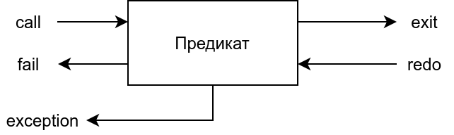

# IV. Отладка

Режимы отладки:

* `debug`/`nodebug`
* `trace`/`notrace`
* `spy`/`nospy`

`leash` - настройка `spy`:
* `full` - полный список
* `half` - `call`, `redo`;
* `loose` - `call`;
* `none`;
* `tight` - `call`, `fail`, `redo`, `exception`.

Отладка включается автоматически при выполнении с включенной трассировки или при выполнении `debug` на предикат, для которого включен `spy`.

В процессе трассировки можно выполнять следующие команды:

* `Enter` - переход к следующей строке доказательства
* `a` - abort
* `h`, `?` - полная справка по командам
